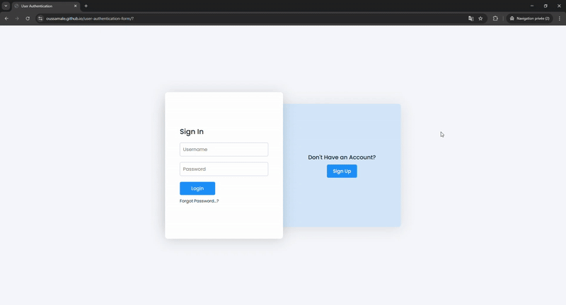

# User Authentication System


A responsive, animated User Authentication interface featuring sliding transition between Sign In and Sign Up forms.

## Demo Preview

<div style="text-align: center;">
  
</div>

## Live Demo
You can check out the User Authentication System in action [here](https://oussamale.github.io/user-authentication-form/).

## Features

*   **Sliding Form Transition:** Smooth animation when switching between "Sign In" and "Sign Up" modes.
*   **Responsive Design:** Fully adaptable layout that works perfectly on desktops, tablets, and mobile devices.
*   **Modern UI:** Clean, minimalist aesthetic with a soothing color palette.
*   **Robust Form Validation:**
    *   **Real-time Feedback:** Instant validation errors and success messages as you type.
    *   **Visual Indicators:** Color changes (Red/Green) to indicate field status.
    *   **Password Strength Meter:** Dynamic bar that indicates password complexity (Weak/Medium/Strong).
*   **User Experience Enhancements:**
    *   **Password Visibility Toggle:** Clickable eye icon to show/hide password text.

## Technologies Used

*   **HTML5:** Semantic markup for structure.
*   **CSS3:** Custom styling, flexbox layout, relative/absolute positioning, and transitions for animations.
*   **JavaScript:** :
    *   Handling class toggling for the sliding effect.
    *   Real-time form validation (Regex for email, length checks, etc.).
    *   Password visibility toggle and strength calculation..
    *   DOM manipulation for UI updates.
*   **Font Awesome:** Used for input field icons (eye, validation status).

## Project Structure

```bash

user-authentication-form/        # Root folder for the project
│
├── README.md                    # Project documentation
├── index.html                   # Main HTML file
├── style.css                    # CSS file for styling and animations
├── script.js                    # JavaScript file for logic to toggle the 'active' class for transitions
└── assets/                      # Folder for media assets
    └── demo.gif                 # Demo GIF
```

## Getting Started

No installation or build steps are required. This is a static web project.

1.  **Clone the repository:**
    ```bash
    git clone https://github.com/oussamale/user-authentication-form.git
    ```
2.  **Navigate to the project folder:**
    ```bash
    cd "user-authentication-form"
    ```
3.  **Run the project:**
    *   Simply double-click the `index.html` file to open it in your default web browser.
    *   **OR** use a local development server (e.g., Live Server in VS Code) for the best experience.

## Improvements & Customization

Feel free to custom this project:
*   **Colors:** Change the `.blueBg` and button colors in `style.css`.
*   **Fonts:** The project uses 'Poppins' from Google Fonts. You can swap this in the `@import` section of `style.css`.
*   **Backend:** This is currently a frontend-only template. You will need to connect the forms to a backend (Node.js, PHP, Python, etc.) to handle actual user registration and login logic.

## License

This project is open source and available under the [MIT License](LICENSE).
